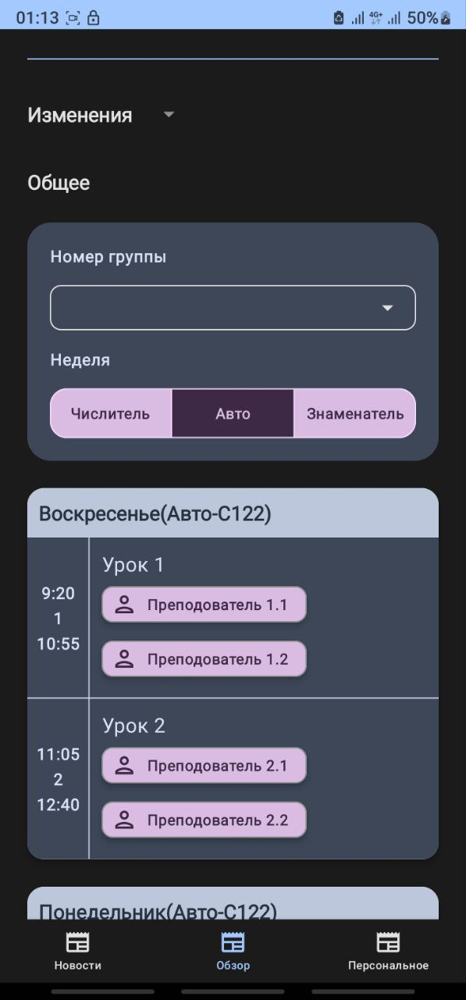
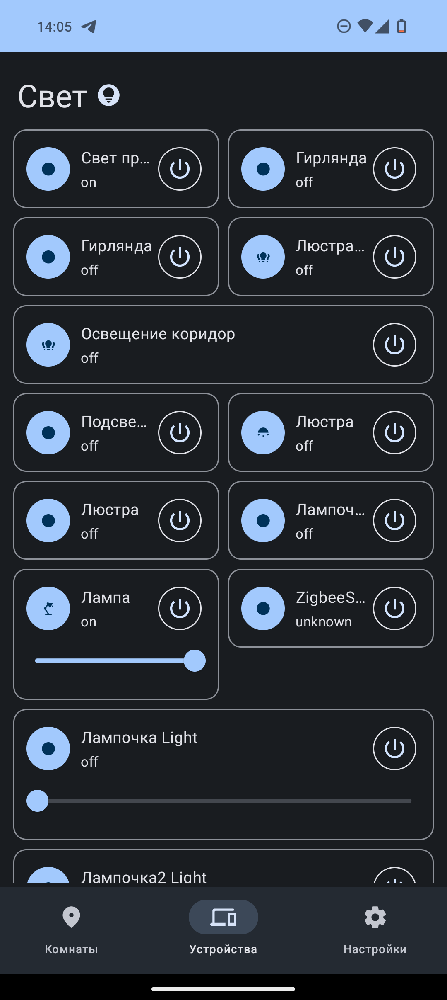
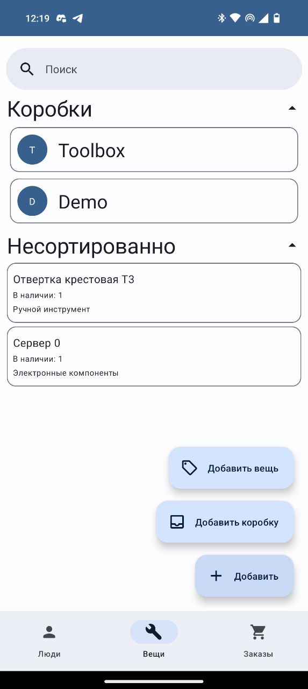
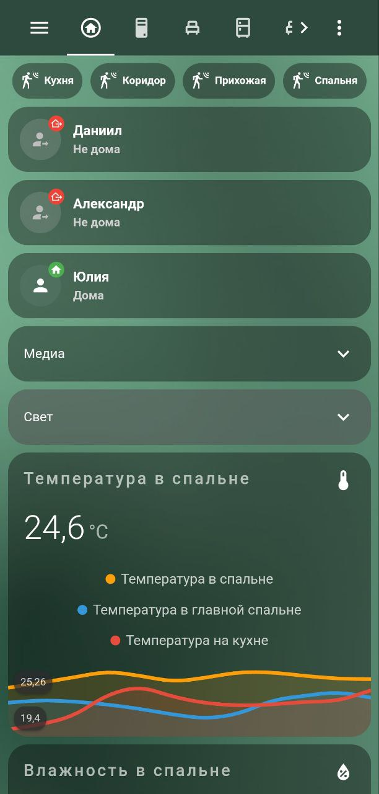

# Что я делаю и что создаю?

В основном я работаю с C# и kotlin. Но мне действительно нравится работать с аппаратной и серверной частью. У меня есть 3D-принтер (Ender 3 pro с парой модификаций), позже планирую опубликовать несколько проектов, в которых используются детали, напечатанные на 3d-принтере
# Проекты
## Расписание ГУАП
Вы можете посмотреть код здесь -> [API](https://github.com/danilkis/GuapScheduleApi.git)
Приложение с расписанием колледжа ГУАП. Создано с использованием FastApi python  и kotlin compose для приложения. В настоящее время версия 3 находится в разработке. Следите за обновлениями!
 Сделано в сотрудничестве с:
[Erich Helvig](https://github.com/bulkabuka) - Дизайнер
[TRiks2004](https://github.com/TRiks2004) - Мобильный разработчик

## [MaterialHass](https://github.com/danilkis/MaterialHass.git)
Android-клиент Home assistant с поддерживаемыми темами material you. В будущем будет мультиплатформенным с использованием Kotlin Compose Multiplatform

## [WorkMan](https://github.com/danilkis/Workman.git)
Мобильное приложение для удовлетворения всех потребностей вашей мастерской, самостоятельно разместите контейнер с supabase на вашем сервере и не надо никаких облаков!
Это приложение работает как на русском, так и на английском языках. Приветствуются любые поправки и добавления к проекту

### Умный дом на Home Assistant

Мой давний проект. Создаю и настраиваю свой умный дом на базе home assistant с 2017-18 годов.

### [Ya.rasp-trains](https://github.com/danilkis/Ya.rasp-trains)
Оболочка на C# для api Яндекс.расписаний.
Проект находится на стадии завершения, и демо-версия библиотеки готова. Необходимо исправить некоторые ошибки, и, возможно, я ее опубликую
