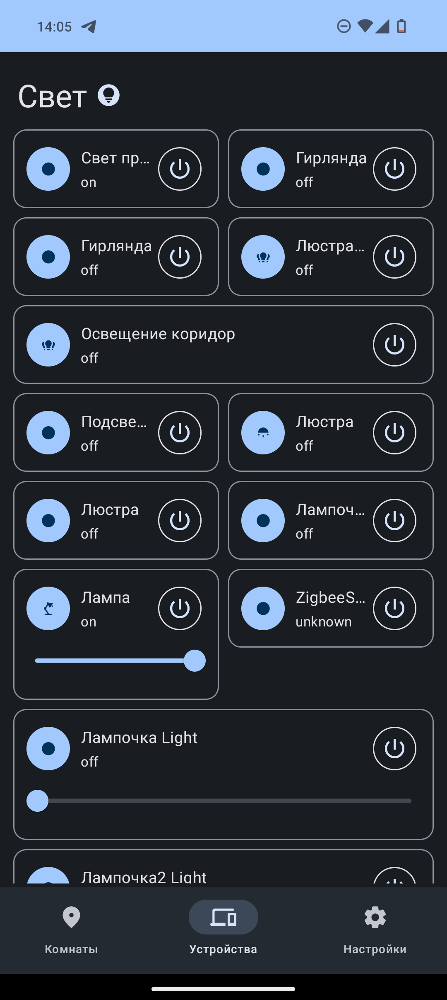

[🇷🇺](README-RU.md)
# What I’m doing and what I’m creating?

I’m mostly working with C# and kotlin. But really enjoy working with the hardware and server side of things. I have a 3D printer (Ender 3 pro with a couple of mods) and planning to post some projects that uses 3d printed parts

# Projects
## GuapSchedule
You can check the code here -> [API](https://github.com/danilkis/GuapScheduleApi.git) 
A schedule app for SUAI college. Made using FastApi python for API and kotlin compose for the app. Currently version 3 is in development. Stay tuned for updates! Made in collaboration with:

[Erich Helvig](https://github.com/bulkabuka) - Designer
[TRiks2004](https://github.com/TRiks2004) - Moblie developer

## [MaterialHass](https://github.com/danilkis/MaterialHass.git)
Home assistant android client with material you support. Will be made multiplatform in the future using Kotlin Compose Multiplatform
.

## [WorkMan](https://github.com/danilkis/Workman.git)
A mobile app to handle all of your workshop needs, self-host supabase on your server and be free from the cloud! This app works in both Russian and English. Any contributions are welcome

### Home assistant smart home

A long running project of mine. I’ve been making and tweaking my smart home based on home assistant since 2017-18.

### [Ya.rasp-trains](https://github.com/danilkis/Ya.rasp-trains)

A C# wrapper for Yandex.schedules api.
The project is in half-finished phase, and demo of library is ready. Some bugs needs to be fixed and maybe i’ll upload it
