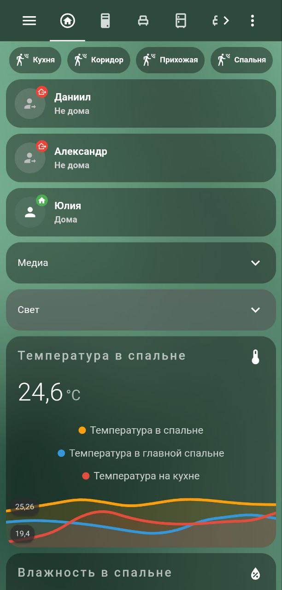

# Heyo👋 Danon is here

# What I’m doing and what I’m creating?

I’m mostly working with C# and kotlin. But really enjoy working with the hardware and server side of things. Have a 3D printer (Ender 3 pro with a couple of mods) and planning to post some projects that uses 3d printed parts

# Any projects?

There is a lot of abandoned projects I made, tho there is some finished or close to finished projects. Annnd here they are!

### Home assistant smart home

A long running project of mine. I’ve been making and tweaking my smart home based on home assistant since 2017-18.

### Spidiron fitness app

(not finished)

This app is supposed to be a test of jetpack compose platform and how to use it. There is some things about the design that could be fixed, but I’m not a designer.

This project is private, and will be made public sometime later, still don’t know when

### Ya.rasp-trains

A C# wrapper for Yandex.schedules api.

The project is in half-finished phase, and demo of library is ready. Some bugs needs to be fixed and maybe i’ll upload it

[https://github.com/danilkis/Ya.rasp-trains](https://github.com/danilkis/Ya.rasp-trains)

# Thanks for your support and help❤️